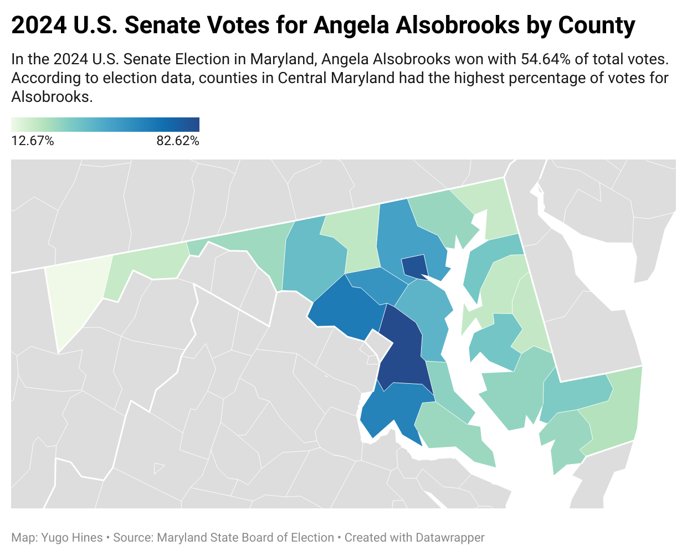
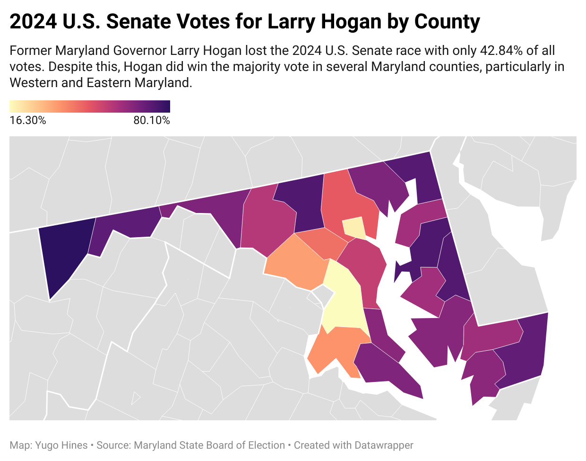

```{r setup, include=FALSE}
knitr::opts_chunk$set(echo = TRUE)
```

## You will need

-   the tidyverse, janitor and tigris libraries
-   you might choose to use the tidycensus library for Q3

## Load libraries and establish settings

**Task** Create a codeblock and load appropriate packages and settings for this lab.

```{r}
# Turn off scientific notation
options(scipen=999)

# Load libraries
library(tidyverse)
library(tidyselect)
library(janitor)
library(tidycensus)
library(sf)
library(tigris)
```

Let's explore the election results from last night and make some maps!

## Questions

**Q1.** Make a county-level map of Maryland's results for U.S. Senate using `md_senate_county_24.csv` in the data folder, calculating the difference between Angela Alsobrooks's percentage of the total votes and Larry Hogan's percentage of the total votes and displaying that percentage difference on the map. What is the story here, and what is the county with the most interesting results?

**I think the story here is how counties in Central Maryland play a major role in determining election results. Prince George's county had the most interesting results with over 82% of voters voting for Alsobrooks.**
##Maps
Alsobrooks: https://datawrapper.dwcdn.net/VTSUM/2/
Hogan: https://datawrapper.dwcdn.net/xzW0e/1/
```{r, echo=FALSE}



```


```{r}

md_senate_county_24 <- read_csv("data/md_senate_county_24.csv")

```

```{r}

md_senate_county_24 <- md_senate_county_24 |>
  mutate(total = (Alsobrooks+Hogan+Scott)) |>
  mutate(alsobrooks_hogan_perc_diff = ((Hogan-Alsobrooks)/((Hogan+Alsobrooks)/2)) * 100) |>
  mutate(alsobrooks_perc = (Alsobrooks/total)*100) |>
  mutate(hogan_perc = (Hogan/total)*100) |>
  mutate(FIPS = case_when(
    County == "Allegany" ~ "24001",
    County == "Anne Arundel" ~ "24003",
    County == "Baltimore City" ~ "24510",
    County == "Baltimore County" ~ "24005",
    County == "Calvert" ~ "24009",
    County == "Caroline" ~ "24011",
    County == "Carroll" ~ "24013",
    County == "Cecil" ~ "24015",
    County == "Charles" ~ "24017",
    County == "Dorchester" ~ "24019",
    County == "Frederick" ~ "24021",
    County == "Garrett" ~ "24023",
    County == "Harford" ~ "24025",
    County == "Howard" ~ "24027",
    County == "Kent" ~ "24029",
    County == "Montgomery" ~ "24031",
    County == "Prince George's" ~ "24033",
    County == "Queen Anne's" ~ "24035",
    County == "Saint Mary's" ~ "24037",
    County == "Somerset" ~ "24039",
    County == "Talbot" ~ "24041",
    County == "Washington" ~ "24043",
    County == "Wicomico" ~ "24045",
    County == "Worcester" ~ "24047"
  ))

```

```{r}
write_csv(md_senate_county_24, "data/md_senate_county_24.csv", col_names = TRUE)
```

**Q2.** Make a county-level map showing the difference between Donald Trump's county-level performance this year and Larry Hogan's, using percentages to compare the two as you did in Q1. You can use the dataframe you initially loaded for Q1, and you'll need to load the 2024 presidential results in the data folder and join them to it before proceeding. Are there any counties where Trump got a higher percentage than Hogan? How would you describe the map showing the Trump-Hogan difference?

Also answer this: is a map the best way to present this data? What else could you make that might convey more information?

**A2.**

```{r}
```

**Q3** Make another map showing the difference between Larry Hogan's county-level performance this year and from his governor race in 2018, using percentages to compare the two as you did in Q2. You can use the dataframe you initially loaded for Q1, and you'll need to load the 2018 governor results in the data folder and join them to it before proceeding. Are there any counties where Hogan did better this year? How would you describe the map showing the difference?

**A3**

```{r}
```

**Q4.** Choose your own map adventure! In the data folder I've included Maryland county-level results for the abortion rights amendment vote this year, plus the 2020 presidential results by county and 2022 governor's results by county. Using one of those and at least one other contest for comparison, make a county-level map showing what you think is the most interesting aspect of that data, and describe the results in terms of a possible story. You can bring in other data, such as Census information, if you like.

**A4.**

```{r}

```

-30-
